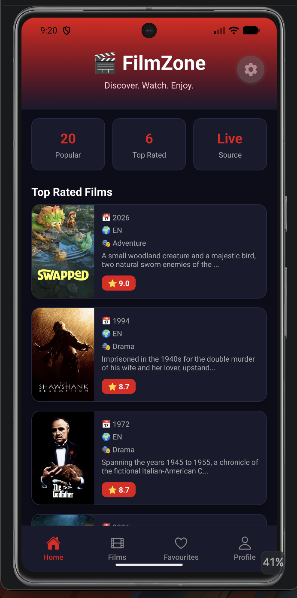
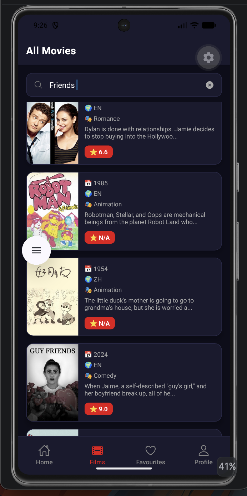
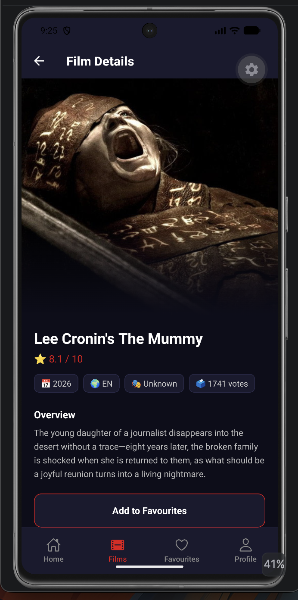
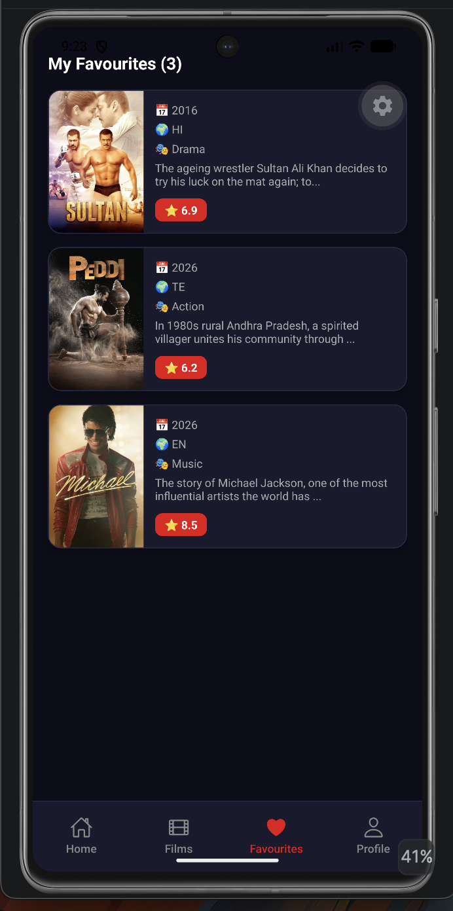
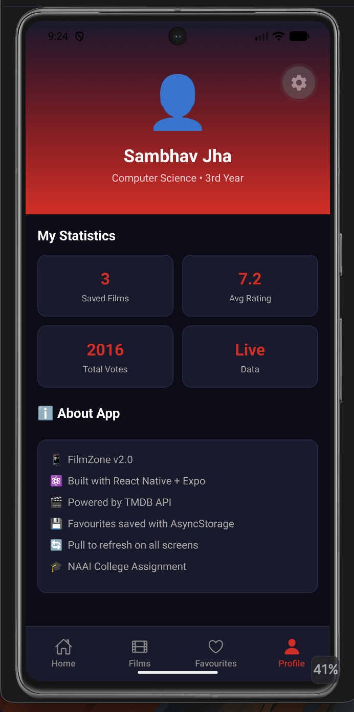

# FilmZone 🎬


---

## Project Description

I made FilmZone, an application using React Native for a college project. My goal was to make it feel real not a basic app with fake information. So FilmZone connects to the TMDB API to get movie information, including posters, ratings and descriptions.

FilmZone also works when there is no internet connection. It does not. Show a blank screen. Instead it uses movie information stored in the application. A banner appears at the top to let the user know they are in offline mode.

People can use FilmZone to look at movies search for movies by name and see details about a movie. They can also save movies to their list of favourites. The list of favourites is stored on the device so it is still there when they close and open FilmZone again.

I made FilmZone one step at a time. First I set up the navigation then I worked on the data then I made the screens and finally I made the user interface look good. The history of changes, to the code shows how I did it.

---

## Features
- You can look at movies that we get from the TMDB API
- When you open the app you will see the top rated movies on the main screen
- If you want to know more about a movie just tap on it and you will see the poster, how good it is, what language it is in   when it was released and what it is about
- You can also search for movies by name and you will get the results right away
- If you like a movie you can add it to your favourites with just one tap
- If you do not like a movie anymore you can remove it from your favourites from the movie details page
- The movies you like are saved so that they are still there when you open the app again thanks to AsyncStorage
- You can even use the app without internet because it has some data built in this is called mode
- We show you a green banner when we get new data from the internet and a red banner when you are offline
- If you want to get the latest movies just pull down on the main screen or the movies screen
- While we are getting the data you will see a spinner so you know something is happening
- If you do not have any movies or if you search for something and we do not find it we will show you a message
- On the Profile screen you can see some statistics, about the movies you have saved
- The app looks nice and clean and it is easy to use because everything is consistent
- We have a bottom menu that makes it easy to get around and the icons help you know where you are
- When you are looking at movies you can go back and forth between the list of movies and the details of a movie using the stack navigation

---

## 📸 Application Screenshots

| Home | Movies |
|------|--------|
|  |  |

| Movie Detail | Favourites |
|-------------|------------|
|  |  |

| Profile |
|---------|
|  |
---

## Installation Steps

**Requirements**
- Node.js installed on your computer
- Expo Go app installed on your Android phone OR Android emulator set up

**Step 1 — Clone the repository**
git clone https://github.com/sambhavjha/FilmZone.git

**Step 2 — Go into the project folder**
cd FilmZone

**Step 3 — Install all dependencies**
npm install 

**Step 4 — Install Expo specific packages**
npx expo install @react-native-async-storage/async-storage expo-linear-gradient @expo/vector-icons react-native-screens react-native-safe-area-context react-native-gesture-handler react-native-reanimated

**Step 5 — Start the development server**
npx expo start --clear

**Step 6 — Open on your device**

Option A — Open Expo Go app on your Android phone and scan the QR code shown in terminal

Option B — Press A in the terminal to open directly on Android emulator

---

## Project Structure
```text
FilmZone/
├── App.js                        — Entry point, wraps context and navigation
├── data/
│   ├── tmdbApi.js                — TMDB API functions with timeout and fallback logic
│   └── fallbackMovies.js         — Offline fallback movie dataset
├── context/
│   └── FavContext.js             — Global favourites state management
├── navigation/
│   └── MainNav.js                — Bottom tab and stack navigation setup
├── components/
│   ├── FilmCard.js               — Reusable movie card component
│   ├── SearchBox.js              — Search input component
│   └── InfoBox.js                — Statistics/info display component
├── screens/
│   ├── HomeScreen.js             — Home page with featured movies
│   ├── AllMoviesScreen.js        — Complete movie listing page
│   ├── FilmDetailScreen.js       — Detailed movie information page
│   ├── MyFavScreen.js            — Favourite movies screen
│   └── MyProfileScreen.js        — User profile and app statistics
└── README.md                     — Project documentation
```
---

## API Details

**TMDB — The Movie Database**
Website: https://www.themoviedb.org
Plan: Free Developer Plan — no monthly fee
Documentation: https://developer.themoviedb.org

Endpoints used in this project:

| Endpoint | Purpose |
|---|---|
| /movie/popular | Fetch popular movies list |
| /movie/top_rated | Fetch top rated movies list |
| /search/movie | Search movies by name |

All API calls have a 6 second timeout using AbortController. If the request fails or times out, the app falls back to local data automatically without crashing.

---

## How Offline Mode Works

When the app starts up or gets refreshed it will try to get in touch with the TMDB API. This request will wait for six seconds before it stops trying. If it does not work for some reason like no internet, slow connection or the API being down the app will show twelve movies that are stored in the fallbackMovies.js file.

The user will see a banner that says they are using the app offline. If they pull down to refresh the app after they get internet again the app will try to contact the TMDB API. If it works this time the app will go back to showing the data from the TMDB API.

This makes sure the user never sees a blank screen no matter what happens with the internet connection

---

## State Management

FilmZone uses the **React Context API** and the **useReducer** hook to manage the state of the application in a very efficient way. This makes it much easier to work with the application. The **React Context API**. The **useReducer** hook help get rid of the need to pass props down to every component. This means that different screens can get to the shared data and update it without any issues.

The `FavContext.js` file is like the centre of the application where all the state is managed. When we wrap the app with this context provider users can see their favourite movies and do things like add or remove them from any screen they want. The **React Context API** makes this all possible by letting users access and update their movies from anywhere, in the application.

### Reducer Actions

| Action | Description |
|----------|-------------|
| **LOAD_SAVED** | Loads previously saved favourite movies from AsyncStorage when the app starts. |
| **ADD_FILM** | Adds a selected movie to the favourites list. |
| **REMOVE_FILM** | Removes a movie from the favourites list using its unique ID. |


---

### Data Persistence

FilmZone uses **AsyncStorage** to save movies on the users device.
- When you add or remove movies from favourites they are saved automatically.
- The saved movies stay on your device when you close the app.
- When you open the app again your saved favourites are loaded back.
- This way your favourites are always there. You have a consistent experience every time you use the app.

---
### Architecture Flow

```text
User Action
     │
     ▼
Screen Component
     │
     ▼
FavContext (Context API)
     │
     ▼
Reducer (useReducer)
     │
     ├── ADD_FILM
     ├── REMOVE_FILM
     └── LOAD_SAVED
     │
     ▼
Updated Global State
     │
     ▼
AsyncStorage
     │
     ▼
Persistent Local Storage
```

This lightweight architecture provides efficient state management, persistent storage, and a clean separation of concerns while keeping the application scalable and easy to maintain.

---

## Packages Used

The following libraries and packages were used to build **FilmZone**, providing navigation, data storage, performance optimization, and a better user experience.

| Package | Purpose |
|----------|---------|
| **@react-navigation/native** | Provides the core navigation system used to move between different screens in the application. |
| **@react-navigation/bottom-tabs** | Creates the bottom tab navigation that allows users to switch between the Home, Favourites, and Profile screens. |
| **@react-navigation/native-stack** | Enables stack-based navigation for screen transitions, such as opening the Movie Detail screen. |
| **react-native-screens** | Improves application performance by using native screen components for navigation. |
| **react-native-safe-area-context** | Ensures that content is displayed correctly on devices with notches, rounded corners, and different screen layouts. |
| **@react-native-async-storage/async-storage** | Provides persistent local storage for saving users' favourite movies between app sessions. |
| **expo-linear-gradient** | Adds visually appealing gradient backgrounds to banners and movie detail screens. |
| **@expo/vector-icons** | Supplies Ionicons and other icon sets used throughout the application's user interface. |

> These packages work together to provide smooth navigation, persistent storage, improved performance, and a modern user interface for FilmZone.

### Why These Packages?
These packages were chosen to make FilmZone easy to use work well and not be too big. They help FilmZone have:
- 📱 easy navigation
- 💾 a way to save things on your phone
- ⚡ fast rendering
- 🎨 nice looking parts
- 🔒 good compatibility with different phones
- 📐 good handling of phone screens
All these packages work together to make FilmZone work well and be nice to use. FilmZone uses these packages to make sure it is a well built application. The packages help make FilmZone a better experience for users.

---

## Challenges Faced During Development

The biggest challenge was building the API and fallback system. It was really tricky to get the AbortController timeout to work right. I did not want the app to hang forever when there was no internet connection.

Another issue I faced was making sure AsyncStorage loaded the saved favourites. I needed to load them before the screens showed up. I solved this by loading the favourites inside a useEffect. This useEffect runs once when the FavProvider starts. I also made the screens wait for the favourites to load.

I had some problems, with modules too. I was using @expo/vector-icons and async-storage. They were not installed correctly. I used npx expo install to fix this. This command installs the version automatically.

---

## Developer Details
| Field | Details |
|--------|---------|
| **Name** | Sambhav Jha |
| **Course** | Bachelor of Technology (B.Tech) in Computer Science with Specialization in Artificial Intelligence |
| **Assignment** | NAAI React Native Mobile Application Assignment |
| **Institution** | Netaji Subhas University of Technology (NSUT) |
| **Submission Year** | 2025 |

---